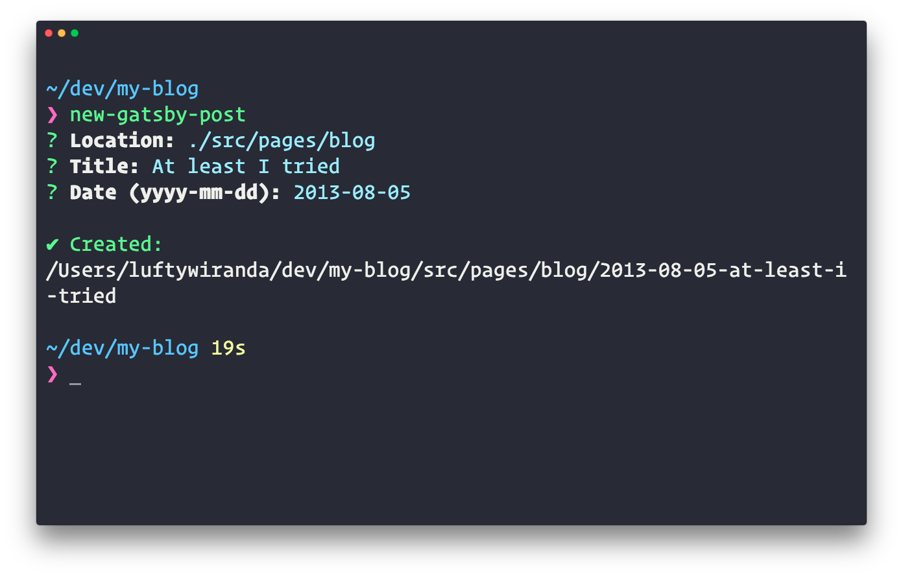

# new-gatsby-post-cli

[](https://greenkeeper.io/)

[](https://www.npmjs.com/package/new-gatsby-post-cli)
[](https://npm-stat.com/charts.html?package=new-gatsby-post-cli&from=2016-04-01)
[](https://travis-ci.org/luftywiranda13/new-gatsby-post-cli)
[](https://ci.appveyor.com/project/luftywiranda13/new-gatsby-post-cli/branch/master)

Interactive CLI tool to scaffold out a new [Gatsby](https://www.gatsbyjs.org/) post

## Why

* Generates folder structure and `frontmatter`
* Easy to use
* Interactive CLI

## Installation

```sh
npm install --global new-gatsby-post-cli
```

## Usage



## Related

* [new-gatsby-post](https://github.com/luftywiranda13/new-gatsby-post) – API for this module
* [create-gatsby-blog-post](https://github.com/DSchau/create-gatsby-blog-post) – Pretty much like this but with no interactive CLI

## License

MIT &copy; [Lufty Wiranda](https://www.luftywiranda.com)
